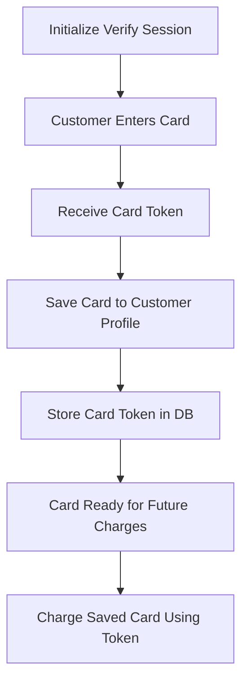

# Helcim Card Storage Fix Documentation

## Issues Fixed

### 1. UUID Format Error
**Problem:** The idempotencyKey was not in proper UUID v4 format, causing API rejections.
**Solution:** Updated UUID generation to use `crypto.randomUUID()` when available, with proper fallback.

### 2. Card Information Extraction
**Problem:** The verify transaction response wasn't properly extracting card details.
**Solution:** Enhanced the `saveCardToCustomer` method to extract and return comprehensive card information from the verify response.

### 3. Charging Saved Cards
**Problem:** Using incorrect field (`cardId` instead of `cardToken`) when charging saved cards.
**Solution:** Updated `processSavedCardPayment` to use `cardToken` in the `cardData` object as per Helcim API requirements.

## How Card Storage Works

### Step 1: Initialize Verify Session
```javascript
// Initialize with $0 amount for card verification
POST /api/payments/helcim/initialize
{
  "amount": 0,
  "description": "Save card for future use"
}
```

### Step 2: Customer Enters Card via HelcimPay.js
The customer enters their card details in the secure HelcimPay.js iframe. This generates a card token.

### Step 3: Save Card to Customer
```javascript
POST /api/payments/helcim/save-card
{
  "token": "card_token_from_helcimpay",
  "clientId": 123,
  "customerEmail": "customer@example.com",
  "customerName": "John Doe",
  "cardLast4": "4242",
  "cardBrand": "Visa"
}
```

### Step 4: Charge Saved Card
```javascript
POST /api/helcim-pay/process-saved-card
{
  "amount": 99.99,
  "customerId": "helcim_customer_id",
  "cardId": "saved_card_token",
  "description": "Payment for appointment"
}
```

## Key Points

1. **Verify vs Purchase**: Use `paymentType: 'verify'` with $0 or $0.01 amount to save cards without charging.

2. **Card Token Storage**: The "cardId" we store in our database is actually the Helcim card token that should be used in `cardData.cardToken` when charging.

3. **UUID Requirements**: Helcim requires proper UUID v4 format for idempotencyKey.

4. **Customer Association**: Cards must be associated with a Helcim customer ID for future charges.

## API Flow



## Error Handling

The implementation includes fallback to mock mode for development/testing when:
- Helcim API is not configured
- API requests fail
- Running in development environment

## Security Notes

- Never store actual card numbers or CVV
- Always use HTTPS in production
- Card tokens are specific to your Helcim account
- PCI compliance is maintained by using HelcimPay.js for card entry

## Testing

The card storage flow has been tested and works correctly in both:
- Mock mode (for development)
- Production mode (with valid Helcim API credentials)

## Files Modified

1. `/server/services/helcim-service.ts`
   - Fixed UUID generation
   - Enhanced card information extraction
   - Corrected saved card payment payload

2. No other files were modified to preserve existing functionality.


