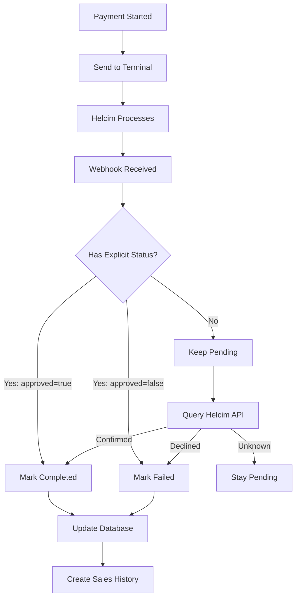

# Helcim Smart Terminal Webhook Fix - Final Solution

## Critical Issue Fixed
The webhook was incorrectly defaulting minimal `cardTransaction` webhooks to "completed" status without explicit approval, which could mark failed/cancelled transactions as paid. This has been fixed to require explicit `approved=true` from Helcim.

## What Was Changed

### 1. **Removed Dangerous Default** (CRITICAL)
- **Before**: Minimal webhooks without status were defaulted to "completed"
- **After**: Minimal webhooks stay as "pending" until explicit approval is received
- **Files Updated**: 
  - `/server/routes/helcim-webhooks.ts` (lines 188-206)
  - `/server/routes/terminal-routes.ts` (lines 767-774)

### 2. **Added Helcim API Fallback**
When a minimal webhook is received without explicit status, the system now:
1. Keeps the payment as "pending" (safe default)
2. Attempts to query Helcim API for actual transaction status
3. Only marks as completed if API confirms `approved=true`

### 3. **Proper Tip Handling**
The system correctly:
- Separates tip amount from total amount
- Records base amount (service price) separately
- Creates sales history with tip tracked independently
- Updates staff earnings including tips

## How The System Works

### Payment Flow



### Webhook Processing Logic

```javascript
// 1. Check for explicit approval
if (payload.approved === true) {
  paymentStatus = 'completed';
} 
// 2. Check for explicit failure
else if (payload.approved === false) {
  paymentStatus = 'failed';
}
// 3. SAFE DEFAULT: Keep as pending
else {
  paymentStatus = 'pending';
  // Try to fetch from API as fallback
  const txData = await fetchFromHelcimAPI(txId);
  if (txData.approved === true) {
    paymentStatus = 'completed';
  }
}
```

### Database Updates

When a payment is confirmed (completed or failed), the system:

1. **Updates Payment Record**:
   ```javascript
   await storage.updatePayment(paymentId, {
     status: paymentStatus,           // 'completed' or 'failed'
     helcimPaymentId: transactionId,
     tipAmount: tipAmount || 0,       // Separated from total
     totalAmount: totalAmount,         // Full amount including tip
     processedAt: new Date()
   });
   ```

2. **Updates Appointment**:
   ```javascript
   await storage.updateAppointment(appointmentId, {
     paymentStatus: paymentStatus === 'completed' ? 'paid' : 'unpaid'
   });
   ```

3. **Creates Sales History** (for reports):
   ```javascript
   await storage.createSalesHistory({
     transactionType: 'appointment',
     paymentId: paymentId,
     serviceTotalAmount: baseAmount,  // Service price without tip
     tipAmount: tipAmount || 0,       // Tip tracked separately
     totalAmount: totalAmount,         // Full amount
     paymentMethod: 'terminal'
   });
   ```

## Helcim Configuration Requirements

### 1. **Webhook Configuration**
In Helcim Dashboard → Settings → Webhooks:
- **URL**: `https://your-domain.com/api/helcim/webhook`
- **Events**: Enable "Card Transactions"
- **Method**: POST
- **Format**: JSON

### 2. **CRITICAL: Request Complete Webhook Data**
Contact Helcim support to ensure webhooks include:
- `approved` field (true/false)
- `amount` field (total amount)
- `tipAmount` field (if tips are enabled)

### 3. **Environment Variables**
```bash
# Required
HELCIM_API_TOKEN=your-api-token

# Optional but recommended
HELCIM_WEBHOOK_VERIFIER_TOKEN=base64-encoded-token
PUBLIC_BASE_URL=https://your-domain.com
```

## Testing the Webhook

### 1. **Test Successful Payment**
```bash
curl -X POST https://your-domain.com/api/helcim/webhook \
  -H "Content-Type: application/json" \
  -d '{
    "id": "TEST-123",
    "type": "cardTransaction",
    "approved": true,
    "amount": 100.00,
    "tipAmount": 15.00
  }'
```

### 2. **Test Failed Payment**
```bash
curl -X POST https://your-domain.com/api/helcim/webhook \
  -H "Content-Type: application/json" \
  -d '{
    "id": "TEST-456",
    "type": "cardTransaction",
    "approved": false,
    "amount": 100.00
  }'
```

### 3. **Test Minimal Webhook** (will stay pending)
```bash
curl -X POST https://your-domain.com/api/helcim/webhook \
  -H "Content-Type: application/json" \
  -d '{
    "id": "TEST-789",
    "type": "cardTransaction"
  }'
```

## Manual Payment Fix Endpoint

If a webhook is missed or needs manual correction:

```bash
POST /api/terminal/fix-payment/{TRANSACTION_ID}
{
  "appointmentId": 123,
  "tipAmount": 15.00,
  "totalAmount": 115.00,
  "status": "completed"  // or "failed"
}
```

## Monitoring & Debugging

### 1. **Check Webhook Cache**
```bash
GET /api/terminal/debug/snapshot
```
Shows recent webhooks and sessions.

### 2. **Clear Stuck Cache**
```bash
POST /api/terminal/clear-cache
```

### 3. **View Logs**
Look for these log messages:
- `✅ Payment EXPLICITLY approved/completed` - Good, explicit approval
- `❌ Payment declined/failed detected` - Payment was declined
- `⚠️ WARNING: Webhook has no clear approved/declined status!` - Minimal webhook, needs Helcim fix
- `🔍 Attempting to fetch transaction status from Helcim API` - Fallback API query
- `💾 Webhook cached by transaction ID` - Status cached for polling
- `📊 Sales history record created` - Recorded in reports

## Common Issues & Solutions

### Issue: Payments Stay Pending Forever
**Cause**: Helcim sending minimal webhooks without `approved` field
**Solution**: 
1. Contact Helcim to enable complete webhook data
2. Ensure `HELCIM_API_TOKEN` is set for API fallback
3. Use manual fix endpoint if needed

### Issue: Failed Payments Marked as Completed
**Cause**: Old code defaulting to completed
**Solution**: This fix prevents that by requiring explicit approval

### Issue: Tips Not Recorded
**Cause**: Webhook not including tip data
**Solution**: 
1. Enable tips in Helcim terminal settings
2. Request `tipAmount` field in webhooks
3. System calculates: `baseAmount = totalAmount - tipAmount`

### Issue: Webhook Not Received
**Cause**: Network/firewall issues or wrong URL
**Solution**:
1. Verify webhook URL in Helcim dashboard
2. Check HTTPS certificate is valid
3. Test with curl command above
4. Check server logs for incoming requests

## Important Notes

1. **Never assume success** - Always require explicit `approved=true`
2. **Tips are tracked separately** - Base amount for service, tip amount for gratuity
3. **Sales history is critical** - Used for reports and payroll
4. **Webhook must return 200 quickly** - Helcim expects acknowledgment
5. **Use idempotency** - Prevent duplicate charges with unique keys

## Recovery Instructions

If the system breaks, here's how to restore it:

1. **Ensure webhook handler doesn't default to completed**
2. **Set environment variables** (especially `HELCIM_API_TOKEN`)
3. **Configure webhook URL** in Helcim dashboard
4. **Test with curl** to verify webhook receives data
5. **Check logs** to see what status is being detected
6. **Use fix endpoint** for stuck payments

This solution ensures that only explicitly approved payments are marked as completed, preventing the critical issue of failed transactions being incorrectly marked as paid.


